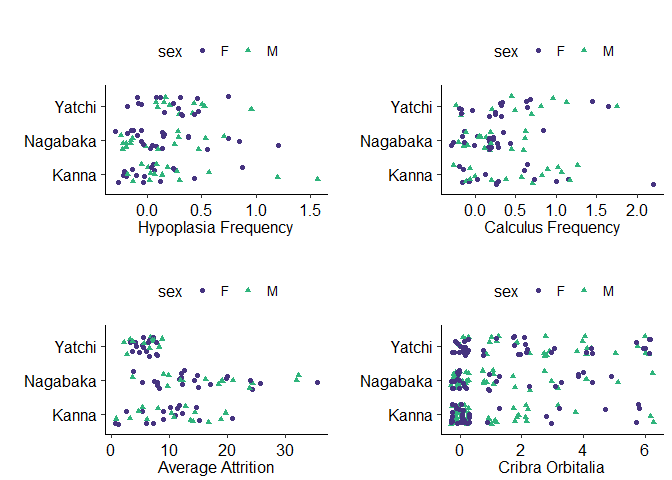
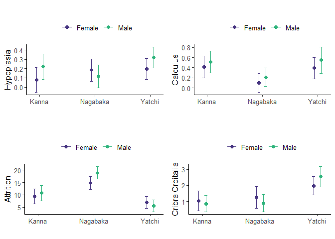

## Abstract
The resilience of socio-ecological systems is enhanced by levels of human well-being which reduce vulnerabilities and promote effective learning responses to change and uncertainty. As an important element of well-being, health serves as a useful proxy for resilience. Human skeletal remains from archaeological contexts can be used to extend the time-depth of our understanding of adaptive cycles. We assess health in human archaeological remains from three sites in the early modern Ryukyu Islands (17th-19th centuries) using three dental markers (enamel hypoplasia, dental attrition, dental calculus) and one skeletal marker (cribra orbitalia). Analysis of these markers are used to identify resilience during a period of considerable socio-ecological change resulting from the colonial control of the Ryukyus by the Satsuma domain of southern Japan. Our results show that a pattern of greater proximity (the Yatchi site) to the centre of political control (Satsuma) resulted in poorer health while distance resulted in relatively better health-a finding consistent with historical data for greater cultural autonomy in the same peripheral area. 

## Testing the normal distribution
Data were plotted against the normal distribution. There  are long tails on either end, otherwise it fits normal. GLM will be used instead of lm since it is more robust to non-normal data.


## Descriptive Statistics
The first three rows of the table are provide a summary of the data by site.
The second three rows of the table provide a summary of female data by site.
The last three rows of the table provide a summary of male data by site.


|site     |    LEH| Calculus|   Wear|     CO|
|:--------|------:|--------:|------:|------:|
|Kanna    | 0.1484|   0.4276| 10.055| 0.8652|
|Nagabaka | 0.1489|   0.1669| 16.879| 1.0260|
|Yatchi   | 0.2582|   0.4548|  6.203| 2.2319|
|Kanna    | 0.0787|   0.4144|  9.343| 1.0303|
|Nagabaka | 0.1835|   0.0972| 14.882| 1.2593|
|Yatchi   | 0.1972|   0.3902|  6.926| 1.9737|
|Kanna    | 0.2229|   0.5104| 10.723| 0.8542|
|Nagabaka | 0.1158|   0.2108| 18.941| 0.8810|
|Yatchi   | 0.3192|   0.5488|  5.481| 2.5484|

## Raw Data Distribution Visualizations
The visualizations show a decent spread across sites with the exception of hypoplasia frequency. There is one outlier, a male from Kanna with an extremely high value of 1.68. 

<!-- -->

## Regression Models
Each variable was a dependent factor in a regression model with site and sex as independent terms and interaction terms. Model summaries are presented in the following order: hypoplasia frequency, calculus frequency, average attrition, cribra orbitalia.


```
Hypoplasia Frequency Model Summary
```


|term              | estimate| std.error| statistic| p.value| conf.low| conf.high|
|:-----------------|--------:|---------:|---------:|-------:|--------:|---------:|
|(Intercept)       |   0.0787|    0.0698|    1.1282|  0.2616|  -0.0580|    0.2155|
|siteNagabaka      |   0.1047|    0.0926|    1.1310|  0.2605|  -0.0768|    0.2863|
|siteYatchi        |   0.1185|    0.0909|    1.3043|  0.1948|  -0.0596|    0.2966|
|sexM              |   0.1442|    0.0987|    1.4614|  0.1467|  -0.0492|    0.3376|
|siteNagabaka:sexM |  -0.2119|    0.1325|   -1.5996|  0.1125|  -0.4715|    0.0477|
|siteYatchi:sexM   |  -0.0222|    0.1285|   -0.1726|  0.8633|  -0.2740|    0.2297|

```
Calculus Frequency Model Summary
```


|term              | estimate| std.error| statistic| p.value| conf.low| conf.high|
|:-----------------|--------:|---------:|---------:|-------:|--------:|---------:|
|(Intercept)       |   0.4144|    0.1094|    3.7887|  0.0003|   0.2000|    0.6288|
|siteNagabaka      |  -0.3172|    0.1452|   -2.1849|  0.0313|  -0.6018|   -0.0327|
|siteYatchi        |  -0.0243|    0.1547|   -0.1569|  0.8756|  -0.3275|    0.2789|
|sexM              |   0.0960|    0.1547|    0.6205|  0.5364|  -0.2072|    0.3992|
|siteNagabaka:sexM |   0.0176|    0.2043|    0.0861|  0.9315|  -0.3829|    0.4181|
|siteYatchi:sexM   |   0.0627|    0.2309|    0.2716|  0.7865|  -0.3898|    0.5152|

```
Average Attrition Model Summary
```


|term              | estimate| std.error| statistic| p.value| conf.low| conf.high|
|:-----------------|--------:|---------:|---------:|-------:|--------:|---------:|
|(Intercept)       |    9.343|     1.536|    6.0815|  0.0000|    6.332|    12.354|
|siteNagabaka      |    5.539|     2.039|    2.7162|  0.0076|    1.542|     9.536|
|siteYatchi        |   -2.417|     1.983|   -1.2189|  0.2254|   -6.305|     1.470|
|sexM              |    1.380|     2.209|    0.6250|  0.5332|   -2.948|     5.709|
|siteNagabaka:sexM |    2.679|     2.897|    0.9247|  0.3570|   -2.999|     8.357|
|siteYatchi:sexM   |   -2.825|     2.833|   -0.9972|  0.3208|   -8.377|     2.727|

```
Cribra Orbitalia Model Summary
```


|term              | estimate| std.error| statistic| p.value| conf.low| conf.high|
|:-----------------|--------:|---------:|---------:|-------:|--------:|---------:|
|(Intercept)       |   1.0303|    0.3131|    3.2904|  0.0012|   0.4166|    1.6440|
|siteNagabaka      |   0.2290|    0.4668|    0.4905|  0.6243|  -0.6859|    1.1438|
|siteYatchi        |   0.9434|    0.4280|    2.2041|  0.0286|   0.1045|    1.7823|
|sexM              |  -0.1761|    0.4068|   -0.4330|  0.6654|  -0.9734|    0.6211|
|siteNagabaka:sexM |  -0.2022|    0.6019|   -0.3359|  0.7373|  -1.3820|    0.9776|
|siteYatchi:sexM   |   0.7508|    0.5958|    1.2602|  0.2090|  -0.4169|    1.9186|

## Plots of Predicted Values (Marginal Effects)
The marginal effects of the model were extracted and used to plot predicted values for each of the dependent variables by sex by site.

<!-- -->

## Conclusion
We found few significant inter-site differences in health markers, suggesting that health was fairly consistent across regions. Using all three markers as guide to understanding trends in health in early modern Ryukyu, we can tentatively argue that Yatchi individuals experienced poorer health but not to a degree of statistical significance. Our data, however, show an inverse relationship between health marker rate and attrition-where attrition is high, health marker values are low. Attrition may have led to an under-reporting of dental markers at Kanna and Nagabaka. The hypoplasia model had the lowest AIC score (model fit) and standard errors, which may reflect the reliability and high repeatability of hypoplasia scoring, especially compared to low reliability and repeatability of cribra orbitalia scoring (Jacobi and Danforth, 2002) and the possibility that dental calculus may have been more difficult to measure accurately on worn teeth. If we use the hypoplasia model as the most robust guide to understanding the situation in early modern Ryukyu, there are few differences across sites. Yatchi is slightly higher than the other two and Kanna has lower values for women while Nagabaka has lower values for men. 

The non-significant variation in health that we observed across sites suggests that standards of living may have varied according to local social and economic conditions rather than an overall decline in health throughout the Ryukyus after Satsuma colonization in 1609. In the early modern era, 'the royal government was better able to regulate the lives of peasants in the regions near the major urban areas of Okinawa than elsewhere' (Smits 1999). Communities in the southern Ryukyus, for instance, were able to use agricultural outputs as leverage to retain local festivals that the Ryukyu government attempted to ban (Moriaki 1980, p. 80). Thus, regions more distant from the center of political control on Okinawa Island were perhaps better able to retain their cultural autonomy and thus reduce vulnerability to change. The relatively greater autonomy of more distant regions may have led to reduced nutritional and metabolic stress. 

Yatchi, located on Kume, an agriculturally productive island on the shipping route between China and Okinawa (Tomiyama 2004b), should have been the site characterized by the greatest economic wealth. Goods were sometimes illegally off-loaded on Kume to avoid Satsuma officials on Okinawa itself, thus presumably benefiting the local economy (Kerr, 2000). Yet, the presence of goods does not translate to access to those goods and the appearance of apparently greater wealth may be misleading. The Kanna site was located away from international trade routes, on the southern edge of the remote yambaru northern region of Okinawa Island. Nagabaka was even more distant from the political centre of early modern Okinawa and, during the early modern period, Miyako and the rest of the southern Ryukyus are considered to have been generally less affluent than the central and northern islands due to the harsh rule of Satsuma (Matsuda 2001). So, while Yatchi may appear to have had greater affluence as a region, perhaps there was differential access to that wealth. These 'local conditions', however, cannot be directly correlated with economic wealth because Yatchi appeared to have greater economic and political interaction with Satsuma but may have been a poor port city population-goods everywhere but none for the locals.

## Appendix: Code for producing the above analysis
All code can also found in scripts in the github repository for this project: https://github.com/kchoover14/RyukyuResilience


```r
knitr::opts_chunk$set(echo = TRUE)
library(dplyr); library(knitr); library(broom)
library(ggplot2); library(ggpubr); library(cowplot)
library(fitdistrplus); library(car); library(ggeffects)

#read data
ryukyu <- read.csv("data-ryukyu-final-dental.csv", stringsAsFactors = TRUE)
ryukyu.co <- read.csv("data-ryukyu-final-cribra orbitalia.csv", stringsAsFactors = TRUE)
#filter by sex
females <- filter(ryukyu, sex == "F")
males <- filter(ryukyu, sex == "M")
females.co <- filter(ryukyu.co, sex == "F")
males.co <- filter(ryukyu.co, sex == "M")
#filter by site for models
kanna <- filter(ryukyu, site=="Kanna")
nagabaka <- filter(ryukyu, site=="Nagabaka")
yatchi <- filter(ryukyu, site=="Yatchi")
kanna.co <- filter(ryukyu.co, site=="Kanna")
nagabaka.co <- filter(ryukyu.co, site=="Nagabaka")
yatchi.co <- filter(ryukyu.co, site=="Yatchi")
qqp(ryukyu$hypoplasia.frequency, "norm", grid=FALSE, ylab=paste("Hypoplasia Frequency"),
  xlab=paste("Normal Distribution Quantiles"))
qqp(ryukyu$calculus.frequency, "norm", grid=FALSE, ylab=paste("Calculus Frequency"),
  xlab=paste("Normal Distribution Quantiles"))
qqp(ryukyu$attrition.average, "norm", grid=FALSE, ylab=paste("Average Attrition"),
  xlab=paste("Normal Distribution Quantiles"))
ryukyu <- group_by(ryukyu, site)
t1 <- summarise(ryukyu, LEH = mean(hypoplasia.frequency, na.rm=TRUE),
  Calculus = mean(calculus.frequency, na.rm=TRUE),
  Wear = mean(attrition.average, na.rm=TRUE))

females <- group_by(females, site)
t2 <- summarise(females, LEH = mean(hypoplasia.frequency, na.rm=TRUE),
  Calculus = mean(calculus.frequency, na.rm=TRUE),
  Wear = mean(attrition.average, na.rm=TRUE))

males <- group_by(males, site)
t3 <- summarise(males, LEH = mean(hypoplasia.frequency, na.rm=TRUE),
  Calculus = mean(calculus.frequency, na.rm=TRUE),
  Wear = mean(attrition.average, na.rm=TRUE))

ryukyu.co <- group_by(ryukyu.co, site)
t4 <- summarise(ryukyu.co, CO = mean(cribra.total, na.rm=TRUE))

females.co <- group_by(females.co, site)
t5 <- summarise(females.co, CO = mean(cribra.total, na.rm=TRUE))

males.co <- group_by(males.co, site)
t6 <- summarise(males.co, CO = mean(cribra.total, na.rm=TRUE))

#bind rows and columns
dental <- rbind(t1,t2,t3)
skull <- rbind(t4,t5,t6)
skull <- dplyr::select(skull, -site)
all <- cbind(dental, skull)
kable(all)
v1 <- ggplot(na.omit(ryukyu), aes(hypoplasia.frequency, site, color = sex, shape=sex)) +
  geom_jitter(width = .3, height = .3) +
  labs(title = "", x="Hypoplasia Frequency", y="") +
  theme_classic2()+
  theme(legend.position = "top")+
  theme(text=element_text(size=12, family="TT Times New Roman"),
        axis.text.x = element_text(color = "black", size = 12),
        axis.text.y = element_text(color = "black", size = 12))+
  scale_colour_viridis_d(begin=.15, end=0.65)

v2 <- ggplot(na.omit(ryukyu), aes(calculus.frequency, site, color = sex, shape=sex)) +
  geom_jitter(width = .3, height = .3) +
  labs(title = "", x="Calculus Frequency", y="") +
  theme_classic2()+
  theme(legend.position = "top")+
  theme(text=element_text(size=12, family="TT Times New Roman"),
        axis.text.x = element_text(color = "black", size = 12),
        axis.text.y = element_text(color = "black", size = 12))+
  scale_colour_viridis_d(begin=.15, end=0.65)

v3 <- ggplot(na.omit(ryukyu), aes(attrition.average, site, color = sex, shape=sex)) +
  geom_jitter(width = .3, height = .3) +
  theme_classic2()+
  labs(title = "", x="Average Attrition", y="") +
  theme(text=element_text(size=12, family="TT Times New Roman"),
        axis.text.x = element_text(color = "black", size = 12),
        axis.text.y = element_text(color = "black", size = 12))+
  theme(legend.position = "top") +
  scale_colour_viridis_d(begin=.15, end=0.65)

v4 <- ggplot(na.omit(ryukyu.co), aes(cribra.total, site, color = sex, shape=sex)) +
  geom_jitter(width = .3, height = .3) +
  labs(title = "", x="Cribra Orbitalia", y="") +
  theme_classic2()+
  theme(text=element_text(size=12, family="TT Times New Roman"),
        axis.text.x = element_text(color = "black", size = 12),
        axis.text.y = element_text(color = "black", size = 12))+
  theme(legend.position = "top")+
  scale_colour_viridis_d(begin=.15, end=0.65)

plot_grid(v1, v2, v3, v4, nrow=2)
#Models.
hypo.model=glm(hypoplasia.frequency ~ site + sex + site:sex, data=ryukyu)
calc.model=glm(calculus.frequency ~ site + sex + site:sex, data=ryukyu)
att.model=glm(attrition.average ~ site + sex + site:sex, data=ryukyu)
co.model=glm(cribra.total~ site + sex +site:sex, data=ryukyu.co)

#Model Summaries
cat("Hypoplasia Frequency Model Summary")
kable(tidy(hypo.model, conf.int = TRUE))
cat("Calculus Frequency Model Summary")
kable(tidy(calc.model, conf.int = TRUE))
cat("Average Attrition Model Summary")
kable(tidy(att.model, conf.int = TRUE))
cat("Cribra Orbitalia Model Summary")
kable(tidy(co.model, conf.int = TRUE))
pa <- ggpredict(hypo.model, terms = c("site", "sex"))
p1 <- plot(pa)+
  scale_colour_viridis_d(begin=.15, end=0.65, name="", labels = c("Female", "Male"))+
  theme_classic2()+
  labs(title="", x= "", y="Hypoplasia")+
  theme(legend.position = "top")

pb <- ggpredict(calc.model, terms = c("site", "sex"))
p2 <- plot(pb)+
  scale_colour_viridis_d(begin=.15, end=0.65, name="", labels = c("Female", "Male"))+
  theme_classic2() +
  labs(title="", x= "", y="Calculus")+
  theme(legend.position = "top")

pc <- ggpredict(att.model, terms = c("site", "sex"))
p3 <- plot(pc)+
  scale_colour_viridis_d(begin=.15, end=0.65, name="", labels = c("Female", "Male"))+
  theme_classic2() +
  labs(title="", x= "", y="Attrition")+
  theme(legend.position = "top")

pd <- ggpredict(co.model, terms = c("site", "sex"))
p4 <- plot(pd)+
  scale_colour_viridis_d(begin=.15, end=0.65, name="", labels = c("Female", "Male"))+
  theme_classic2()+
  labs(title="", x= "", y="Cribra Orbitalia")+
  theme(legend.position = "top")

plot_grid(p1, p2, p3, p4, nrow=2)
```
